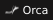

## Tech Stack 
### Languages

  
  
  
  
  
  
  
  

### Frameworks

  
  
  

### Preferred Tools

  
  
  
  

  
  
  
  
  

  
  
  
  

  
  
  
  
  
  
  

  
  
  
  

### Exploring

  
  
  
  

## Stats

